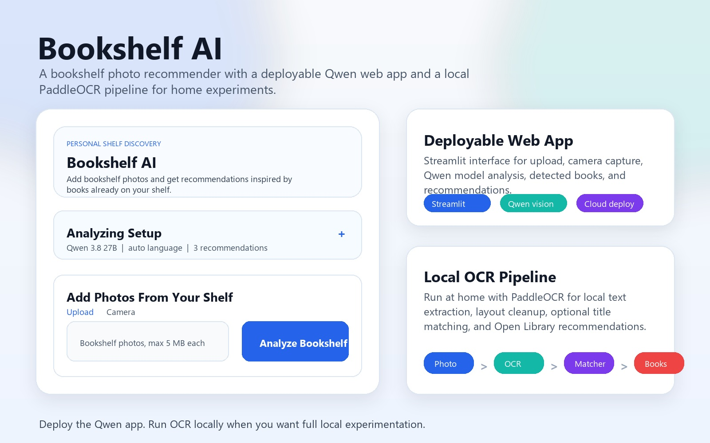

# Bookshelf AI

Bookshelf AI recommends books from photos of your bookshelf.

The project has two ways to run:

1. **Deployable app**: a Streamlit web interface that reads shelf photos with a Qwen vision model and returns detected books plus recommendations.
2. **Local OCR pipeline**: a command-line workflow for running PaddleOCR at home on your own machine.



## What It Does

### Deployable Streamlit App

- Upload bookshelf photos or take photos from a camera.
- Choose analysis settings from the collapsed `Analyzing Setup` panel.
- Use a Qwen vision model to read visible book spines.
- Show detected books and recommendation cards in a phone-friendly interface.
- Deploy with lightweight dependencies on Streamlit Community Cloud.

### Local OCR Pipeline

- Reads text from bookshelf photos using PaddleOCR, including rotated OCR passes.
- Groups OCR fragments by detected shelf layout.
- Cleans noisy OCR fragments into possible title and author candidates.
- Optionally matches candidate titles with Google Books and Open Library.
- Uses Open Library metadata to recommend related books.

## Project Structure

```text
streamlit_app.py       Deployable Streamlit interface
groq_bookshelf.py      Qwen vision request helper used by the Streamlit app
groq_check.py          Local command-line check for the Qwen vision flow
main.py                Local OCR command-line entry point
ocr.py                 PaddleOCR setup and OCR result parsing
matcher.py             Layout-aware OCR cleanup and title matching
recommender.py         Open Library recommendation engine
requirements.txt       Lightweight dependencies for Streamlit deployment
requirements-ocr.txt   Optional heavier dependencies for local OCR
bookshelf.jpg          Sample bookshelf image for testing
```

## Setup

Create and activate a virtual environment:

```bash
python -m venv .venv
```

On Windows:

```bash
.venv\Scripts\activate
```

On macOS or Linux:

```bash
source .venv/bin/activate
```

Install the deployable app dependencies:

```bash
python -m pip install -r requirements.txt
```

Create a local `.env` file for the Qwen-powered app:

```text
GROQ_API_KEY=your_api_key_here
```

Do not commit `.env`; it is ignored by Git.

## Run the Streamlit App Locally

```bash
streamlit run streamlit_app.py
```

Then open:

```text
http://localhost:8501
```

## Deploy on Streamlit Community Cloud

Create a new Streamlit app with:

- Repository: `rustamdurdyyev/Bookshelf-AI`
- Branch: `master`
- Main file path: `streamlit_app.py`

In Streamlit secrets, add:

```toml
GROQ_API_KEY = "your_api_key_here"
```

The deployed app uses `requirements.txt`, so it does not install the heavier PaddleOCR packages.

## Test the Qwen Vision Flow Locally

```bash
python groq_check.py bookshelf.jpg
```

With a few photos:

```bash
python groq_check.py bookshelf.jpg bookshelf_rupam.jpeg --limit 5
```

With a language hint:

```bash
python groq_check.py bookshelf_turkish.png --language Turkish
```

## Run the Local OCR Pipeline

Install the optional OCR dependencies:

```bash
python -m pip install -r requirements-ocr.txt
```

Run the OCR pipeline:

```bash
python main.py bookshelf.jpg
```

Choose an OCR language:

```bash
python main.py bookshelf_turkish.png --ocr-lang tr
python main.py bookshelf_russian.webp --ocr-lang ru
```

Change the number of recommendations:

```bash
python main.py bookshelf.jpg --limit 5
```

Debug OCR without generating recommendations:

```bash
python main.py bookshelf.jpg --skip-recommendations
```

## Notes

- Use the Streamlit/Qwen app for deployment.
- Use the PaddleOCR pipeline when running locally and experimenting with OCR.
- Supported image formats include `.jpg`, `.jpeg`, `.png`, and `.webp`.
- The Qwen app is easier to deploy because it does not need local OCR models.

## License

This project is open source. Feel free to use, modify, and share.
